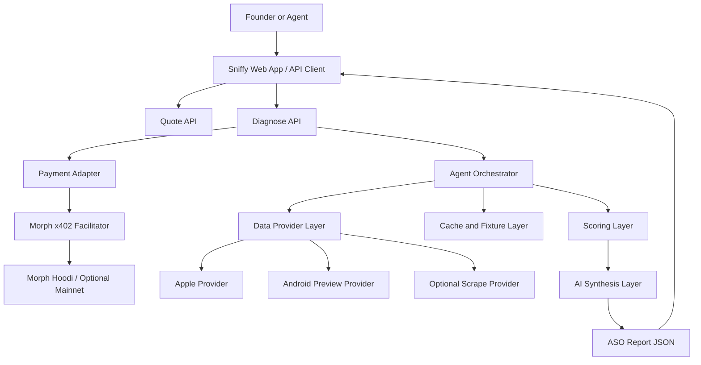

# Sniffy PRD

## 1. Product Summary

Sniffy is a pay-per-sniff ASO intelligence API and demo product for indie app founders and AI agents. A founder or agent submits an App Store or Play Store app, target country, and keywords. Sniffy quotes the cost, gates the full diagnosis behind x402 on Morph, then returns a structured ranking report with competitor clues, metadata fixes, and ready-to-use app listing recommendations.

The hackathon product is not "an ASO dashboard that happens to accept crypto." It is an x402-native paid HTTP resource: app-store intelligence that agents can discover, price, pay for, and consume one request at a time. ASO is the useful resource being sold; x402 on Morph is the money layer that makes the resource agent-buyable.

Sniffy has two product layers:

- Layer 1: an x402-paywalled ASO data API that agents, scripts, and indie builders can call directly.
- Layer 2: a founder-facing co-pilot UI where Sniffy visibly buys data, follows the ranking trail, and produces an app distribution action plan.

The MVP should be built on Morph Hoodi testnet by default and use Morph's official x402 facilitator at `https://morph-rails.morph.network/x402`. A custom facilitator is not part of the MVP unless the official route specifically blocks Hoodi judging.

The repo should be split into two top-level apps:

- `landing`: Vercel-deployed landing page and frontend demo.
- `scraper`: Railway-deployed backend API, payment adapter, data providers, cache logic, and agent orchestration.

## 2. Problem

Indie founders know ASO matters, but most ASO tools are priced and shaped for agencies, growth teams, or companies with recurring research budgets. A solo builder who wants to test a few markets should not need a $100-$200 monthly subscription or another dashboard to learn which keywords, countries, and competitors matter.

AI agents also need paid, structured market intelligence. Today, an agent can write app copy, but it usually lacks fresh app-store context and has no clean way to pay for a single ASO answer.

## 3. Target Users

### Primary User

Solo app founders and indie hackers shipping globally with AI assistance.

Representative user:

- Builds fast.
- Ships apps into multiple countries.
- Cares about discoverability but does not want to become an ASO analyst.
- Wants one concrete answer: what should I change, and where should I launch next?
- Does not want another subscription.

### Secondary User

AI agents, coding agents, app-launch workflows, and automation tools that need programmatic access to ASO intelligence.

Examples:

- Claude Code or Cursor agent preparing release metadata.
- Vercel AI SDK app that optimizes listing copy.
- n8n workflow that checks competitor reviews before launch.
- MCP client that pays for individual data tools.

### Where the Personas Actually Meet Sniffy

The indie hacker and the agent are not separate users at runtime — they are the same workflow. The modern indie hacker lives inside their coding agent (Claude Code, Cursor, Codex, Claude Desktop), so their *primary entry point* to Sniffy is whatever surface that agent can install:

- The **agent kit** (`SKILL.md` + MCP server + CLI + SDK, defined in §22) is the indie-hacker surface. It is how a real founder will reach for Sniffy a second time.
- The **web demo** (`landing/`) is the judge surface. It exists to make the x402 spend trail and the report payload visibly clickable in a browser during a 2-minute demo.

Both surfaces call the same `scraper` API. The PRD treats them as peers, not as primary/secondary tiers.

## 4. Positioning

### Product Name

`Sniffy`

### Tagline

`Pay-per-sniff ASO intelligence for founders and agents.`

### Supporting Hero Line

`Sniff out what is costing your app rankings.`

### Product Promise

Sniffy helps founders get found, pick winnable markets, and improve app-store metadata. It does not promise guaranteed rank #1 outcomes. Rankings also depend on retention, install velocity, ratings, reviews, product quality, and category dynamics.

### Hackathon Thesis

`Sniffy turns app-store intelligence into an agent-buyable HTTP resource. Instead of subscriptions, API keys, sales calls, or dashboards, an AI agent pays a few cents over x402 on Morph and gets exactly the ranking, competitor, or localization insight it needs.`

## 5. Goals and Non-Goals

## 5A. Market Reality and Competitive Positioning

### Hackathon Track Fit

Sniffy fits the `x402 Agentic Payments` track if x402 is core infrastructure, not a decorative checkout button. The hackathon track asks teams to create `AI-native or API-based micropayment systems with low-cost settlement` and to `build the money layer the agentic internet is waiting for`. Sniffy is designed as that kind of API-based micropayment system: agents pay per ASO data/report call, and the API returns a paid, machine-readable resource.

Judge-facing interpretation:

- The ASO report is the paid digital good.
- The HTTP API is the resource server.
- x402 is the payment protocol.
- Morph Hoodi is the low-cost settlement layer for the demo.
- The AI agent or scripted client is the buyer.
- The frontend is only the demo surface, not the core product.

Track-fit requirements:

- The paid ASO diagnosis must be exposed as an HTTP API, not only as a frontend button.
- The paid endpoint must return `402 Payment Required` when payment is missing.
- The client/agent flow must retry with x402 payment and receive the report.
- The demo must show Morph x402 settlement, receipt metadata, and a clear spend trail.
- Pricing must be usage-based: per keyword, country, competitor depth, or report type.
- The ASO use case must be framed as a real agentic payment problem: agents need fresh, paid app-market data without accounts, subscriptions, or API-key contracts.

Required demo proof:

- A judge can open the public demo without login or mandatory payment.
- A judge can view a free sample report and quote.
- A judge can see the API return `402 Payment Required` before payment.
- A judge can see the same request succeed after x402 payment.
- The paid response includes receipt, network, facilitator, transaction/link, request ID, and data provenance.
- The 2-minute video explicitly shows the paid API flow, not just the UI report.

Important submission constraint:

- The public demo URL must be accessible without login and without a mandatory paywall.
- Therefore, the public UI must include a free sample report and/or free quote flow that judges can inspect immediately.
- The x402 paywall should protect the API diagnosis endpoint and optional live unlock path, not the entire demo site.

Verdict:

- In scope if Sniffy is presented as `pay-per-use app-market intelligence for agents and founders`.
- Weak fit if Sniffy is presented as `an ASO dashboard that happens to accept crypto`.
- Out of scope risk if the Morph/x402 payment flow is not functional, only appears as mocked UI, or is hidden behind a normal SaaS-style checkout.

### Reality Check

Indie hackers will not automatically want Sniffy just because ASO tools are expensive. The market already has:

- Free or low-cost ASO audits.
- Mature ASO dashboards.
- First-party analytics inside App Store Connect and Google Play Console.
- Cheap indie-focused tools.
- AI-powered ASO copilots.

Sniffy should not claim to have better proprietary ASO data than AppTweak, MobileAction, Appfigures, Asolytics, or similar mature tools. Those products have deeper datasets, historical tracking, keyword databases, download/revenue estimates, reporting, and team workflows.

Sniffy should compete on workflow and payment model, not raw data depth.

### Existing Alternatives

- Asolytics: free plan plus paid plans for keyword research, competitors, metadata tools, and app insights.
- AppTweak: mature ASO and market intelligence platform with keyword databases, live keyword searches, download/revenue estimates, AI agents, and AI visibility features.
- MobileAction: ASO intelligence, keyword tracking, metadata analysis, app intelligence, review analysis, Apple Ads, and API solutions with low entry pricing.
- Appfigures: app analytics plus ASO tooling, keyword ranks, popularity scores, app intelligence, and APIs.
- ASOZen: instant ASO audits, scoring, keyword gaps, AI metadata writing, and a free tier.
- Kōmori ASO, ASO.dev, GrowASO, ASOMobile, and similar indie-focused tools: lower-cost ASO workflows with rank tracking, AI metadata, keyword suggestions, and competitor analysis.
- App Store Connect and Google Play Console: first-party analytics, conversion data, product page/store listing experiments, and owner-only data that third-party tools cannot fully replace.

### Why Not Just Use Asolytics or Another Tool?

Users should use Asolytics, AppTweak, MobileAction, Appfigures, or App Store Connect if they need:

- Persistent tracking.
- Historical trends.
- Full dashboards.
- Team workflows.
- Exporting/reporting.
- Large keyword lists.
- Proprietary volume, download, or revenue estimates.
- Ongoing ASO operations.

Sniffy is worse for those jobs in the MVP.

### Where Sniffy Can Win

Sniffy can win when the user wants:

- One answer, not another dashboard.
- Pay-per-use instead of subscription commitment.
- Agent-readable JSON.
- A workflow that fits Claude Code, Cursor, n8n, or custom launch scripts.
- A quick pre-launch or relaunch diagnosis.
- A concrete copy/action output, not just metrics.
- A visible x402 spend trail showing what each data call bought.
- A low-friction way to test an ASO idea before subscribing to a bigger platform.

### Switch vs. Supplement

Sniffy should not expect serious ASO teams to switch from mature platforms. The realistic adoption path is:

1. Pre-subscription: founder uses Sniffy before they know whether ASO is worth investing in.
2. Between subscriptions: founder needs occasional ASO answers but not monthly tooling.
3. Agent workflow: founder wants ASO data inside their coding/release assistant.
4. Supplemental use: founder already uses App Store Connect or Appfigures but wants a second-opinion action plan.

The product should be framed as a wedge, not a full replacement.

### Why Would Someone Pay?

An indie founder might pay if Sniffy saves them from:

- opening five dashboards;
- manually searching competitors across countries;
- asking an LLM to guess without app-store context;
- buying a monthly subscription for one metadata decision;
- reading competitor reviews by hand;
- translating ASO advice into ready-to-paste listing copy.

The paid output must therefore be implementation-ready. If the report is generic, Sniffy loses.

### Why Would They Not Pay?

Likely objections:

- They can use Asolytics or ASOZen free tiers.
- They already have Appfigures, AppTweak, MobileAction, or App Store Connect.
- x402 wallet/payment setup is unfamiliar.
- Public data may be less trustworthy than established providers.
- ASO alone may not move installs without retention, ratings, conversion, and launch velocity.
- They may only care after they already have traffic.

Mitigation:

- Make free sample output excellent.
- Keep payment optional until after value preview.
- Avoid overclaiming data quality.
- Show confidence and provenance.
- Position as "pay for one action plan," not "replace your ASO stack."
- Consider non-crypto payment or credits post-hackathon if targeting normal indie developers outside the x402 ecosystem.

### Competitive Thesis

Sniffy is not "Asolytics but cheaper." Sniffy is "an agent-native ASO action API." The core differentiation is composability:

- humans get a simple co-pilot;
- agents get a paid API;
- every report is structured, auditable, and pay-per-sniff;
- Morph x402 is part of the product behavior, not decorative payment plumbing.

### Payment Friction Strategy

Wallet and USDC setup is real friction for normal indie hackers. It is acceptable for the hackathon demo because the track is explicitly about x402 agentic payments, and judges should expect testnet payment flows. It is not acceptable as the only long-term onboarding path for mainstream indie developers.

MVP in scope:

- Use Morph Hoodi testnet so judges can test without real funds.
- Show a free quote before asking for payment.
- Provide a free sample report so users see value before wallet setup.
- Use Reown AppKit for wallet connection.
- Make the payment state transparent: amount, network, token, facilitator, and receipt.
- Include a short "How to fund testnet wallet" panel for judges.

MVP not in scope:

- Fiat card checkout.
- Production on-ramp/off-ramp.
- Account balances or stored credits.
- User accounts.
- Subscription billing.

Demo messaging:

- Say clearly: "For the hackathon, Sniffy uses Morph Hoodi testnet so agents and judges can try pay-per-use without real funds."
- Then say: "For real indie users, the same product can add card-funded credits or Reown/AppKit on-ramp later, while keeping x402 as the agent/payment rail under the hood."

Post-hackathon friction reducers:

- Free first sniff.
- Card-funded credit balance.
- Walletless email/social login with embedded wallet.
- Mainnet on-ramp through Reown AppKit or another provider.
- Team/API keys for non-agent users.
- Monthly cap and spending controls for agents.

Product decision:

- Do not solve mainstream fiat onboarding during the hackathon.
- Do acknowledge it in the demo and PRD.
- For the MVP, optimize for judge clarity and agent-native x402 behavior, not mainstream consumer checkout.

### Goals

- Demonstrate a real Morph x402 pay-per-use API.
- Prove the "money layer for agents" pattern with a concrete paid data resource.
- Let a founder run a free quote and unlock a paid ASO diagnosis.
- Return useful, structured, agent-readable JSON.
- Show visible payment/data steps in the UI so judges understand what each sniff bought.
- Make the demo reliable with live, cached, and fixture fallback paths.
- Use Sniffy's pixel detective mascot and Lottie states to make the product memorable.

### Non-Goals

- Do not build a full Asolytics, AppTweak, or Sensor Tower clone.
- Do not claim proprietary keyword volume, download estimates, or revenue estimates.
- Do not make full Android parity mandatory.
- Do not require paid ASO data providers for the MVP.
- Do not require fiat off-ramp for the demo.
- Do not build or fork a facilitator unless the official Morph facilitator blocks Hoodi usage.
- Do not add a relational database for MVP unless report history becomes required.

## 6. MVP Scope

### Required

- Public web demo.
- Free quote endpoint.
- Shallow-scan teaser inside the quote response (app-specific detected metadata + one preview keyword bucket, see §9). Closes the value-before-wallet gap.
- Paid diagnosis endpoint using x402.
- Free sample endpoint.
- iOS-first public app lookup and metadata analysis.
- Keyword rank sampling where feasible.
- Competitor detection and competitor steal plan.
- Metadata scoring and recommendations.
- Pixel detective Sniffy branding.
- Lottie states for loading, unlock, no-data, and report reveal.
- Receipt and provenance metadata in paid responses.
- Agent-distribution surface (see §22):
  - `SKILL.md` at repo root (Vercel skills format, installable via `npx skills add <org>/asosniffy-com`).
  - `@sniffy/sdk` — thin TypeScript client shared by CLI and MCP.
  - `@sniffy/cli` — `npx sniffy quote|diagnose|sample`.
  - `@sniffy/mcp` — MCP server exposing `sniffy_quote`, `sniffy_diagnose`, `sniffy_sample` tools.
- Repo published open-source under MIT (see §23) — required because the `npx skills add` install path needs a public GitHub repo.

### Optional if Time Allows

- Android preview.
- Review forensics.
- Multi-country opportunity scoring.
- Metadata draft endpoint.
- Mainnet $0.01 demo-video transaction.
- Vercel AI SDK tool snippet, n8n node, Zapier integration, Cursor `.cursorrules` rule, Claude Code subagent definition (post-hackathon enrichments — see §22.7).

## 7. Core User Flows

### Flow A: Human Founder Demo

1. User opens Sniffy.
2. User pastes App Store URL, app ID, or app name.
3. User selects country.
4. User enters 1-5 keywords.
5. User clicks `Run free sniff test`.
6. Sniffy returns a quote:
   - detected app;
   - keywords;
   - estimated price;
   - expected data coverage;
   - Sniff ID.
7. User clicks `Unlock full trail`.
8. Sniffy triggers x402 payment on Morph Hoodi.
9. After payment, Sniffy shows:
   - ranking diagnosis;
   - competitor trail;
   - metadata suspects;
   - best next actions;
   - ready-to-paste metadata suggestions.

### Flow B: Agent/API Consumer

1. Agent calls `POST /api/v1/aso/quote`.
2. Agent receives price, Sniff ID, and expected report contents.
3. Agent calls `POST /api/v1/aso/diagnose`.
4. API returns `402 Payment Required`.
5. Agent signs/pays through x402 and retries.
6. API returns full JSON report plus receipt metadata.

### Flow C: Weak Data

1. User submits app or keyword with poor public data coverage.
2. Sniffy returns low-confidence or no-rank state, not a broken error.
3. UI shows `sniffy-no-scent`.
4. Report suggests broader keywords, another country, or manual competitor input.

## 8. Functional Requirements

### Quote

The system must:

- Normalize app identifiers from URL, app ID, or app name.
- Validate keyword count: minimum 1, maximum 5 for MVP.
- Validate country code.
- Estimate price before payment.
- Return Sniff ID and request ID.
- Return data coverage estimate.
- Return whether the request is likely to use live data, cache, or fixture fallback.
- Return a `shallowScan` block with detected app identity, category, ratings summary, and one preview keyword's coarse rank bucket. The block must surface enough app-specific signal to motivate payment, but must not include recommendations, full keyword diagnosis, competitor trail, metadata score, or ready-to-paste content (those remain paid-only). See §9 for the exact shape.

### Diagnosis

The system must:

- Return HTTP `402 Payment Required` when payment is missing or invalid.
- Include machine-readable x402 payment requirements in both the response body (Sniffy-friendly `payment` summary + canonical `accepts[]`) and the canonical `PAYMENT-REQUIRED` HTTP header (Base64 JSON of `{ x402Version, error, resource, accepts[] }`) so `@x402/fetch`-style clients can settle without parsing the body. On 200, return the receipt in both the body and the `PAYMENT-RESPONSE` header.
- Verify and settle through the Morph x402 facilitator after payment.
- Fetch or reuse app metadata, keyword results, competitor candidates, and review samples where available.
- Produce deterministic scores before AI synthesis.
- Generate founder-readable and agent-readable recommendations.
- Return receipt metadata and data provenance.

### Sample

The system must:

- Return a complete sample report without payment.
- Use realistic data structure.
- Work even when all live providers are down.
- Be suitable for judges, docs, and API clients.

### UI

The UI must:

- Make the first screen the working tool, not a landing page.
- Show the quote before payment.
- Show the x402 unlock state clearly.
- Show what the agent is buying in a visible spend trail.
- Mark results as `live`, `cached`, `fixture`, or `inferred`.
- Support reduced-motion preferences.
- Work on desktop and mobile.

## 9. API Requirements

### `POST /api/v1/aso/quote`

Purpose: free pricing and feasibility preview.

Request:

```json
{
  "store": "ios",
  "app": "https://apps.apple.com/us/app/example/id123456789",
  "country": "US",
  "keywords": ["habit tracker", "daily planner"],
  "competitors": ["id987654321"]
}
```

Response:

```json
{
  "requestId": "req_...",
  "sniffId": "sniff_...",
  "store": "ios",
  "country": "US",
  "detectedApp": {
    "id": "123456789",
    "name": "Example App",
    "developer": "Example Studio"
  },
  "pricing": {
    "currency": "USDC",
    "network": "morph-hoodi",
    "estimatedTotal": "0.05",
    "breakdown": [
      { "label": "base diagnosis", "amount": "0.03" },
      { "label": "2 keywords", "amount": "0.02" }
    ]
  },
  "coverage": {
    "appMetadata": "high",
    "keywordRank": "medium",
    "competitorTrail": "medium",
    "reviews": "low"
  },
  "shallowScan": {
    "title": "Example App",
    "subtitle": "Habit & Routine Tracker",
    "primaryCategory": "Productivity",
    "ratingsSummary": { "average": 4.6, "count": 1240 },
    "previewKeyword": {
      "keyword": "habit tracker",
      "rankBucket": "11-30",
      "confidence": "medium",
      "provenance": "live"
    }
  },
  "next": {
    "paidEndpoint": "/api/v1/aso/diagnose"
  }
}
```

The `shallowScan` block intentionally narrows what is exposed for free: detected app identity, category, ratings summary, and one preview keyword bucket. Recommendations, full keyword diagnosis, competitor trail, metadata score, and ready-to-paste content remain paid-only. This gives the calling indie hacker (or agent) something app-specific in hand before the wallet step, without giving away the paid report.

### `POST /api/v1/aso/diagnose`

Purpose: paid full ASO report.

Unpaid response:

```json
{
  "error": "payment_required",
  "sniffId": "sniff_...",
  "payment": {
    "x402Version": 2,
    "network": "eip155:2910",
    "facilitator": "https://morph-rails.morph.network/x402",
    "amount": "0.05",
    "asset": "USDC_OR_TEST_TOKEN_ADDRESS",
    "payTo": "MERCHANT_WALLET_ADDRESS"
  }
}
```

Paid response:

```json
{
  "requestId": "req_...",
  "sniffId": "sniff_...",
  "reportVersion": "2026-05-mvp",
  "receipt": {
    "network": "eip155:2910",
    "facilitator": "morph-official",
    "amount": "0.05",
    "asset": "USDC_OR_TEST_TOKEN_ADDRESS",
    "transactionHash": "0x...",
    "settledAt": "2026-05-18T10:00:00Z"
  },
  "dataProvenance": {
    "appMetadata": "live",
    "keywordRank": "cached",
    "competitors": "live",
    "recommendations": "inferred"
  },
  "summary": "Your title is underusing the highest-intent keyword...",
  "keywordDiagnosis": [
    {
      "keyword": "habit tracker",
      "rankBucket": "11-30",
      "intentScore": 0.74,
      "confidence": "medium",
      "provenance": "live",
      "recommendation": "...",
      "popularityScore": 42,
      "popularitySource": "apple-search-ads",
      "popularityAsOf": "2026-05-18T09:00:00Z",
      "relatedTerms": ["habit", "habit goal", "daily habit"],
      "trend": null,
      "difficulty": 71,
      "minDifficulty": 38,
      "difficultyIsFallback": false,
      "matchKind": "subtitleAllWords"
    }
  ],
  "competitorTrail": [],
  "metadataScore": {},
  "recommendations": [],
  "readyToPaste": {},
  "targetAppSignals": {
    "ratingsPerDay": 12.4,
    "momentumLabel": "growing",
    "daysSinceFirstRelease": 412,
    "daysSinceLastRelease": 9
  }
}
```

The `difficulty` / `minDifficulty` / `difficultyIsFallback` / `matchKind` fields on each `keywordDiagnosis` row, plus the top-level `targetAppSignals` block, are derived from a keyword-difficulty formula adapted from [semihcihan/App-Store-Optimization-CLI](https://github.com/semihcihan/App-Store-Optimization-CLI) (MIT — see `LICENSE-THIRD-PARTY.md`). `difficulty` is `null` and `difficultyIsFallback: true` when the top-5 competitor gate trips (rate-limit, niche keyword); we never fabricate the number. `targetAppSignals` is `null` for region-locked listings without a `releaseDate`.

### `GET /api/v1/aso/sample`

Purpose: free demo response.

Response must use the same shape as the paid diagnosis response, with a `sample: true` field.

## 10. Architecture



### Repo Layout

The repo is a pnpm workspace. The two deployable apps (`landing/`, `scraper/`) keep their original split; `packages/*` are npm-publishable libraries that do not deploy to Vercel or Railway.

```
asosniffy-com/
├── landing/                 (Next.js, Vercel)
├── scraper/                 (Hono, Railway, Docker)
├── packages/
│   ├── sdk/                 (@sniffy/sdk — thin TypeScript client)
│   ├── cli/                 (@sniffy/cli — `npx sniffy ...`)
│   └── mcp/                 (@sniffy/mcp — MCP server)
├── SKILL.md                 (Vercel skills format, repo root)
├── LICENSE                  (MIT)
├── NOTICE
├── SECURITY.md
├── CONTRIBUTING.md
├── README.md
├── pnpm-workspace.yaml
├── PLAN.md
└── CLAUDE.md
```

The SDK's request/response types derive from the Zod schemas in `scraper/`, so the SKILL.md, CLI, and MCP stay aligned with the §9 API contract automatically. Both deployable apps and all three packages share the root `pnpm-lock.yaml`.

### Tech Stack

`landing`:

- Framework: Next.js + TypeScript.
- Hosting: Vercel.
- Styling: Tailwind CSS.
- UI components: lightweight local components, shadcn/ui-style patterns if useful.
- Icons: lucide-react.
- Animation: Lottie via `lottie-react`, plus static reduced-motion fallbacks.
- Wallet UX: Reown AppKit.
- API client: typed fetch client pointed at the Railway `scraper` base URL.

`scraper`:

- Runtime: Node.js + TypeScript.
- API framework: Hono or Fastify. Prefer Hono if keeping the backend small and fetch-native; use Fastify if plugin ecosystem or longer-lived server needs become more important.
- Hosting: Railway web service.
- Containerization: Dockerize the backend with a simple Node image for predictable Railway builds and future portability.
- Payment: official Morph x402 facilitator at `https://morph-rails.morph.network/x402`.
- Web3 utilities: viem for EVM encoding/signature helpers where needed.
- Data providers: Apple iTunes Search API, public App Store page/search sampling, Android preview provider.
- AI synthesis: OpenAI API if available; deterministic template fallback if not.
- Cache: Redis-compatible cache only, preferably Upstash Redis or Railway Redis.
- Tests: Vitest for backend logic and endpoint behavior.

Shared:

- Package manager: pnpm.
- Schema validation: Zod for request/response validation.
- Report fixtures: committed JSON fixtures under `scraper`.
- No relational database for MVP.

### Containerization Decision

Containerize only the `scraper` backend.

Reasons:

- Predictable backend builds on Railway.
- Easier migration to Cloud Run, Fly.io, or another container host later.
- Cleaner setup if browser/scraping dependencies are added.
- Better separation between frontend and backend deployment concerns.

Do not containerize `landing`. Deploy `landing` directly through Vercel's native Next.js flow.

Initial `scraper` container should use a boring Node image such as `node:22-slim`. If Playwright/browser scraping becomes required, switch `scraper` to a Playwright base image.

### System Layers

1. Sniffy Web App
   - Lives in `landing`.
   - Deployed on Vercel.
   - Next.js frontend.
   - Quote form, report view, API docs, wallet connection, Lottie animations.
   - Shows spend trail and data provenance.

2. Agent Orchestrator
   - Lives in `scraper`.
   - Deployed on Railway.
   - Coordinates tool calls: app lookup, keyword rank, competitor trail, review summary, metadata draft.
   - Keeps factual data separate from AI synthesis.

3. x402 ASO Data API
   - Lives in `scraper`.
   - Deployed on Railway as the standalone backend.
   - Public API for quote, diagnosis, and sample.
   - Returns JSON first, readable summaries second.

4. Payment Adapter
   - Lives in `scraper`.
   - Owns x402 payment requirements, verify, settle, receipt metadata, and network config.
   - Modes: `morph-hoodi`, `morph-mainnet`, `mock-local`, `self-hosted-facilitator-fallback`.

5. Data Provider Layer
   - Lives in `scraper`.
   - Apple provider.
   - Android preview provider.
   - Optional scraping provider adapter.

6. Cache and Fixture Layer
   - Lives in `scraper`.
   - Request cache.
   - Demo fixture reports.
   - Provider failure fallback.
   - Use Redis-compatible cache at most for MVP; no database required.

7. Scoring and AI Synthesis
   - Lives in `scraper`.
   - Deterministic scoring first.
   - AI-generated recommendations second.
   - Template fallback if model API key is unavailable.

### Deployment Topology

`landing` on Vercel:

- Hosts marketing/landing content and the live frontend demo.
- Calls the Railway API over HTTPS.
- Contains no long-running scraping logic.
- May include lightweight server actions only if needed for frontend ergonomics, but all canonical API behavior belongs in `scraper`.

`scraper` on Railway:

- Hosts the standalone Sniffy API.
- Owns x402 payment verification/settlement.
- Owns all app-store data providers and scraper/provider adapters.
- Owns Redis cache access and fixture fallback.
- Can later add background workers or cron refresh jobs without changing the frontend deployment.

### MVP Storage Decision

Do not use Postgres/Supabase or another relational database for MVP.

Use only:

- Local fixture JSON for guaranteed demo responses.
- In-memory cache for local development.
- Redis-compatible cache, preferably Upstash Redis or Railway Redis, for deployed caching.

Cache keys should be deterministic by store, country, app ID, keyword set, provider version, and report version. Reports do not need permanent history for the hackathon.

## 11. Data Requirements

### iOS First

Use:

- Apple iTunes Search API for public app lookup and metadata.
- Public App Store pages/search sampling where feasible.
- Cached fixtures for reliability.
- Optional App Store Connect API only when the app owner provides credentials.
- Optional Apple Search Ads keyword popularity only if access is available.

### Android Preview

Use:

- Public Play Store lookup/search sampling.
- Lower-confidence labels.
- Fixture fallback.

Do not claim complete Android rank accuracy in the MVP.

### Data Provenance

Every report field should be labeled as one of:

- `live`: fetched during this request;
- `cached`: reused from previous successful request;
- `fixture`: demo fallback data;
- `inferred`: produced by scoring or AI from available evidence.

## 12. Payment Requirements

### Facilitator

Use official Morph x402 facilitator:

- Base URL: `https://morph-rails.morph.network/x402`
- Verify: `POST /v2/verify`
- Settle: `POST /v2/settle`
- Supported: `GET /v2/supported`
- Auth: HMAC headers from Morph x402 Console access key and secret key.

### Default Network

Use Morph Hoodi testnet for development, judging, and public demo.

Verify before implementation:

- Morph mainnet chain ID: `2818`, CAIP-2 `eip155:2818`.
- Morph Hoodi chain ID: `2910`, CAIP-2 `eip155:2910`.
- Hoodi RPC: `https://rpc-hoodi.morph.network`.
- Hoodi explorer: `https://explorer-hoodi.morph.network`.
- Supported networks from `GET https://morph-rails.morph.network/x402/v2/supported`.
- Test payment token address, decimals, EIP-712 name, and EIP-712 version.
- Whether token path is EIP-3009, Permit2, or Morph-specific exact transfer.

If official facilitator support for Hoodi is unavailable, request the Hoodi route/API credentials from Morph or use fallback only for the Hoodi demo.

### Pricing

MVP pricing model:

- Base diagnosis fee.
- Add-on per keyword.
- Add-on per country.
- Add-on for competitor depth.

Do not force `$0.001` live settlement until Morph token/facilitator behavior is confirmed. The concept can show granular pricing, while the live demo should use a reliably settling Hoodi amount.

### Receipt Metadata

Paid responses must include:

- Request ID.
- Sniff ID.
- Network name and CAIP-2 chain ID.
- Payment amount.
- Asset symbol and contract address.
- Facilitator mode.
- Transaction hash or clearly labeled test receipt.
- Timestamp.
- Report cache key.

## 13. Branding and Motion Requirements

### Mascot

Sniffy is a pixel-art detective dog with a tiny magnifying glass. The mascot should feel curious, clever, and direct, not childish.

### Voice

Use playful UI terms:

- `Sniff test`
- `Scent trail`
- `Competitor trail`
- `Ranking clues`
- `Metadata suspects`
- `Best next sniff`

Keep API docs and reports clean and professional.

### Visual Direction

- Off-white/ink base.
- Signal yellow.
- Bright teal.
- Red-orange warning accents.
- Pixel pawprints and clue markers in small doses.
- Clean product UI, not a full retro game interface.

### Lottie Animations

MVP animation files:

1. `sniffy-sniffing-loader`
   - Loop.
   - Trigger: quote, lookup, diagnosis generation.
   - Scene: Sniffy follows a dotted scent trail that becomes keyword chips.

2. `sniffy-x402-unlock`
   - One-shot.
   - Trigger: valid x402 payment.
   - Scene: lock opens, receipt appears, Sniffy finds report.

3. `sniffy-no-scent`
   - Subtle loop.
   - Trigger: app not found, no rank, weak data.
   - Scene: broken scent trail, Sniffy points to a new clue.

4. `sniffy-report-reveal`
   - One-shot.
   - Trigger: report ready.
   - Scene: clues snap into a ranked report board.

Requirements:

- Store under `public/lottie/`.
- Keep each under roughly 150 KB if possible.
- Pair with accessible text.
- Respect reduced-motion settings with static pixel frames.

## 14. Reliability Requirements

The demo must not fail because public store data is flaky.

Required reliability behavior:

- Sample endpoint always works.
- Every live provider has cache fallback.
- Every critical demo state has fixture fallback.
- The UI distinguishes live, cached, fixture, and inferred data.
- Payment errors are explicit and recoverable.
- Weak-data states produce useful next steps.

Weak-data cases:

- App not found.
- Keyword not ranked.
- Country unsupported.
- Competitor missing.
- Play Store preview unavailable.
- Apple public API rate limit.
- Payment missing, expired, malformed, or on wrong network.

## 15. Success Metrics

### Hackathon Success

- Public demo URL works without login.
- Quote endpoint works without payment.
- Diagnose endpoint demonstrates real `402 Payment Required`.
- Paid flow settles through Morph Hoodi or clearly disclosed fallback.
- Report is useful within 60 seconds.
- Demo video clearly shows problem, quote, x402 unlock, report, and next steps.

### Product Success

- A founder can understand the recommendation without learning an ASO dashboard.
- An agent can consume the JSON without custom parsing.
- The product feels worth paying for one sniff at a time.
- Judges can see Morph/x402 usage as core, not decorative.

## 16. AI Agents, Skills, and Subagents

This section distinguishes two different uses of "agent" that the rest of the PRD conflates:

- **§16A Build-Time AI Agents** are the Claude-based subagents and skills used *while building* Sniffy. They produce code, content, and review.
- **§16B Runtime Agent Surfaces** are the indie-hacker- and AI-consumer-facing artifacts that *call* Sniffy at runtime — SKILL.md, MCP server, CLI, SDK. These are specified in detail in §22.

## 16A. Build-Time AI Agents

### AI Agents Needed

1. Product Strategy Agent
   - Owns positioning, judge story, scope control, and Sniffy tone.

2. Morph x402 Protocol Agent
   - Owns network config, facilitator integration, HMAC signing, payment headers, receipts, Hoodi verification, and optional mainnet check.

3. ASO Data Agent
   - Owns Apple/Google data feasibility, public data limits, confidence labels, and cache strategy.

4. Full-Stack Demo Agent
   - Owns web UI, route handlers, API docs, wallet UI, and demo polish.

5. AI Synthesis Agent
   - Owns scoring explanations, competitor steal plan, metadata rewrites, and deterministic fallback templates.

6. QA and Demo Reliability Agent
   - Owns test matrix, fixtures, browser checks, curl examples, and demo failure handling.

7. Build-in-Public Content Agent
   - Owns required posts, architecture diagram copy, demo video outline, and final submission write-up.

### Codex Skills to Use

- `firecrawl-search`
  - Research current Morph/x402 docs, ASO competitors, public API constraints, and ecosystem examples.

- `firecrawl-scrape`
  - Pull docs and reference pages into local notes.

- `browser:browser`
  - Verify local UI, paid-flow states, mobile layout, and API docs.

- `openai-docs`
  - Use only if integrating OpenAI APIs for synthesis.

- `imagegen`
  - Optional for mascot assets, static fallback frames, social images, or hero art.

### Implementation Subagents

Use only after implementation begins.

- Explorer: Morph x402 verification.
- Explorer: ASO data feasibility.
- Worker: frontend demo surface.
- Worker: API and data pipeline.
- Worker: x402 payment adapter.
- Worker: QA/demo package.

## 16B. Runtime Agent Surfaces

The artifacts that AI agents and indie-hacker scripts use to *consume* Sniffy at runtime are specified in §22 (Agent-Distribution Surface). Summary:

- `SKILL.md` — Vercel skills format, installable across 55+ coding agents.
- `@sniffy/mcp` — MCP server, three tools, x402 handled under the hood.
- `@sniffy/cli` — terminal entry point for scripts and humans.
- `@sniffy/sdk` — typed TypeScript client; the substrate for CLI and MCP.

These are the load-bearing distribution channels for the indie-hacker persona. See §22 for full specification and §23 for the open-source posture that enables their distribution.

## 17. Implementation Milestones

### Milestone 0: Pre-Build Validation

- Confirm Morph facilitator supported networks via `/v2/supported`.
- Confirm Hoodi route/token support.
- Confirm Reown AppKit Morph Hoodi wallet behavior.
- Test Apple lookup/search inputs.
- Test Play Store lookup from hosting environment.
- Confirm team registration requirements.
- Confirm Railway service can reach Apple/Google/public store pages.
- Confirm Redis choice: Upstash Redis or Railway Redis.

### Milestone 1: Functional MVP

- Scaffold `landing` and `scraper` folders.
- Deploy `landing` to Vercel.
- Deploy `scraper` to Railway.
- Implement quote/sample.
- Implement payment adapter shell.
- Implement paid endpoint returning real `402`.
- Implement fixture-backed report.

### Milestone 2: Data and Report Quality

- Add Apple lookup.
- Add keyword rank sampling.
- Add competitor trail.
- Add scoring.
- Add AI/template synthesis.
- Add provenance and confidence labels.

### Milestone 3: Demo Polish

- Add Sniffy pixel branding.
- Add Lottie states.
- Add Reown wallet connection.
- Add spend trail.
- Add docs/curl examples.
- Verify mobile/desktop.

### Milestone 3.5: Distribution Surface

- Implement `@sniffy/sdk` against the Railway endpoints. Derive request/response types from the `scraper/` Zod schemas.
- Implement `@sniffy/cli` on top of the SDK. Include `--json` flag for piping; pretty terminal output with provenance icons by default.
- Implement `@sniffy/mcp` exposing three tools: `sniffy_quote`, `sniffy_diagnose`, `sniffy_sample`. Tool descriptions written for agent consumption. Wallet config read from env (`SNIFFY_PRIVATE_KEY`) with explicit testnet-only warning.
- Author `SKILL.md` at repo root (Vercel skills format).
- Add `LICENSE` (MIT), `NOTICE`, `SECURITY.md`, `CONTRIBUTING.md`, repo-root `README.md`.
- Verify no secrets in commit history; confirm `.gitignore` covers `.env*` and any wallet/key files.
- Flip repo visibility to public on GitHub.
- Smoke-test installs: `npx skills add asosniffy/asosniffy-com` inside a Claude Code project, the MCP server inside Claude Desktop, the CLI in a fresh terminal.
- Publish `@sniffy/sdk`, `@sniffy/cli`, `@sniffy/mcp` to npm (or document local-link install path if publishing is deferred past the demo cut).

### Milestone 4: Submission Package

- Record demo video.
- Publish build diary posts.
- Prepare 200-word write-up.
- Add architecture diagram.
- Prepare fallback demo script.

## 18. Test Plan

### API Tests

- Quote with 1 keyword.
- Quote with 5 keywords.
- Quote with explicit competitors.
- Diagnose without payment returns `402`.
- Diagnose with valid Hoodi payment returns `200`.
- Diagnose includes receipt metadata.
- Sample endpoint returns valid JSON.

### Data Tests

- iOS lookup by App Store URL.
- iOS lookup by app ID.
- iOS lookup by app name.
- Country-specific lookup.
- Keyword not ranked.
- App not found.
- Android preview unavailable.

### Frontend Tests

- Desktop flow.
- Mobile flow.
- Long app names.
- Long keywords.
- Free quote state.
- Payment required state.
- Paid report state.
- No-data state.
- Reduced-motion state.

### Payment Tests

- `/v2/supported` reachable.
- HMAC signature valid.
- Missing payment returns `402`.
- Wrong network is rejected.
- Valid Hoodi payment settles.
- Receipt transaction link opens in explorer.

## 19. Risks and Mitigations

### Risk: Hoodi support is not available through official facilitator

Mitigation: ask Morph for Hoodi route/API credentials; use fallback only for Hoodi demo if needed.

### Risk: Public store scraping fails

Mitigation: cache, fixtures, provider adapters, and honest provenance labels.

### Risk: Play Store CAPTCHA/rate limits

Mitigation: keep Android as preview; use fixtures or optional scraper provider only if needed.

### Risk: ASO recommendations overpromise

Mitigation: confidence labels and honest copy: Sniffy helps founders get found, not guarantee rank.

### Risk: Lottie production eats time

Mitigation: create simple pixel-inspired vector loops first; use static frames if needed.

### Risk: Scope grows into full ASO suite

Mitigation: MVP remains quote, paid diagnosis, sample, and one strong report.

## 20. Submission Assets

### 200-Word Write-Up Draft

Sniffy lets indie app founders and AI agents buy one ASO answer at a time. Instead of subscribing to a heavy analytics suite, a founder submits an app, country, and keywords. The API quotes the job, returns `402 Payment Required`, accepts x402 payment on Morph Hoodi testnet, and returns a structured visibility diagnosis with competitor gaps, metadata recommendations, receipt data, and provenance. The same endpoint is agent-readable, so AI tools can price, pay for, and retrieve app-market intelligence programmatically. This matters for Philippine and Southeast Asian builders because many are shipping globally but cannot justify expensive monthly ASO tools for occasional launch decisions. Sniffy uses public app-store data, cache-backed reliability, and confidence labels to keep recommendations honest. The demo shows the full agentic payment loop: free quote, raw `402`, x402 unlock, Morph settlement trail, and a practical report for improving discoverability.

### Demo Video Structure

- 0:00-0:30: problem and chosen x402 use case: agents need paid app-market intelligence without subscriptions or API-key contracts.
- 0:30-1:30: live quote, raw `402 Payment Required`, x402 retry/payment on Hoodi, receipt, and final report.
- 1:30-2:00: next steps: Android parity, review forensics, multi-country opportunity scoring, owner-provided App Store Connect data.

### Build Diary Posts

- Post 1: problem, product story, and Sniffy mascot.
- Post 2: Morph x402 quote/unlock architecture.
- Post 3: live ASO report and agent-readable API.

Use `#MorphBuildSprint` and `#MorphBuildPH`.

## 21. Open Questions

- Does the official Morph facilitator currently expose Hoodi through `/v2/supported`?
- Which Hoodi payment token should the demo use, and what are its EIP-712 fields?
- Will Reown AppKit's on-ramp UI be useful on testnet, or should it be framed as mainnet onboarding roadmap only?
- Is Apple Search Ads keyword popularity available in time, or should it remain a post-MVP enrichment?
- Who are the 3-4 registered team members?

## 22. Agent-Distribution Surface

Sniffy's product thesis is that ASO is an agent-buyable resource. The agent-distribution surface is how that thesis becomes installable — the SKILL.md, MCP server, CLI, and SDK that an indie hacker reaches for from inside their existing agent. This section is the canonical spec for those four artifacts. They are MVP-required (§6) and the open-source posture in §23 is what makes their install one-liners work.

### 22.1 Surfaces Overview

| Surface | Who installs it | How they install it | Scope |
|---|---|---|---|
| `SKILL.md` | Any user of Claude Code, Cursor, Codex, OpenCode, or other Vercel-skills-aware agent | `npx skills add asosniffy/asosniffy-com` | General API instruction the agent reads before calling Sniffy. |
| `@sniffy/mcp` | Claude Desktop, Cursor, or any MCP client user | MCP config block (see §22.6) | Three callable tools wrapped around the API; handles x402 under the hood. |
| `@sniffy/cli` | Any developer with `npx` | `npx @sniffy/cli quote ...` | Terminal-native entry point for scripts and humans. |
| `@sniffy/sdk` | Any TypeScript/JavaScript project | `npm i @sniffy/sdk` | Typed client; the substrate for CLI and MCP. Also usable directly. |

All four surfaces target the same `scraper` API and share the same payment flow. The differences are envelope and ergonomics, not capability.

### 22.2 `SKILL.md`

Located at repo root. Vercel skills format:

```yaml
---
name: sniffy
description: Pay-per-sniff ASO intelligence for App Store apps. Use when a user asks for keyword diagnosis, competitor analysis, or metadata recommendations for an iOS app. Handles x402 payment on Morph Hoodi automatically.
---

# Sniffy

[Body teaches the agent four things:
  (a) the three endpoints and their request/response shapes,
  (b) how to read a 402 Payment Required, sign x402 on Morph Hoodi (eip155:2910), and retry,
  (c) the provenance labels (live/cached/fixture/inferred) and how to surface them in agent output,
  (d) error semantics — payment_required, app_not_found, no_rank, unsupported_country.]
```

The body is **general API instruction**, not named recipes. The agent is trusted to compose workflows from the primitives. The trade-off is intentional: named recipes calcify the product surface and bloat the file; general instruction lets the agent figure out the workflow from the user's request.

### 22.3 `@sniffy/mcp`

A Node-based MCP server. Three tools:

- `sniffy_quote` — input: `{ store, app, country, keywords[], competitors[]? }`. Returns the quote response from §9 including `shallowScan`.
- `sniffy_diagnose` — input: same as above plus `{ sniffId }`. Wraps the x402 payment flow: on first attempt the upstream API returns 402, the MCP server signs and pays via the configured wallet, then retries. Returns the paid report with receipt metadata.
- `sniffy_sample` — input: none. Returns the canned sample response. Useful for agents that want to inspect the report shape before committing to a paid call.

Wallet config: testnet signer read from env (`SNIFFY_PRIVATE_KEY`). Each tool description includes an explicit "testnet only — do not use a mainnet key" warning so agents surface this to the user.

### 22.4 `@sniffy/cli`

Commands:

- `npx sniffy quote <url-or-id> -k <keyword1,keyword2,...> [-c <country>]`
- `npx sniffy diagnose <url-or-id> -k <keyword1,keyword2,...> [-c <country>]`
- `npx sniffy sample`

Default output is human-readable: provenance icons (●live ◐cached ○fixture ◇inferred), section headers, color-coded confidence. `--json` flag pipes the raw response. Wallet config via the same env var pattern as MCP.

### 22.5 `@sniffy/sdk`

Tiny typed client. Public surface:

```ts
import { createSniffy, PaymentRequiredError } from "@sniffy/sdk";

const sniffy = createSniffy({
  baseUrl: "https://api.sniffy.io",       // default
  signer,                                  // optional viem account; required for .diagnose()
});

const quote = await sniffy.quote({ store: "ios", app, country, keywords });
try {
  const report = await sniffy.diagnose({ sniffId: quote.sniffId });
} catch (err) {
  if (err instanceof PaymentRequiredError) {
    // intercept and surface payment details to user
  }
  throw err;
}
```

The `PaymentRequiredError` is intentionally typed and exported so consumers can build their own payment UX rather than rely on the SDK's auto-pay behavior.

### 22.6 Distribution Channels

```bash
# Install the skill (Vercel skills CLI, after repo is public per §23)
npx skills add asosniffy/asosniffy-com

# Use the SDK
npm i @sniffy/sdk

# Use the CLI
npx @sniffy/cli quote https://apps.apple.com/us/app/example/id123456789 -k "habit tracker,daily planner"
```

MCP config snippet for Claude Desktop or Cursor:

```json
{
  "mcpServers": {
    "sniffy": {
      "command": "npx",
      "args": ["-y", "@sniffy/mcp"],
      "env": {
        "SNIFFY_PRIVATE_KEY": "0x..."
      }
    }
  }
}
```

### 22.7 Out of Scope for MVP

The following agent-integration surfaces are deferred past the hackathon cut. They are listed here so the roadmap is visible without committing to ship them on the demo timeline:

- Vercel AI SDK tool snippet (drop-in `tool({ ... })` definition).
- n8n node template.
- Zapier integration.
- Cursor `.cursorrules` rule for opinionated ASO-aware prompts.
- Claude Code subagent definition (`.claude/agents/sniffy.md`).
- Browser extension that surfaces Sniffy on App Store pages.

## 23. Open-Source & Commercial Posture

The agent-distribution surface in §22 only works if the repo is public — `npx skills add <org>/<repo>` fetches from GitHub. The repo is therefore published open-source. This section documents the licensing choice and the commercial strategy that makes open-source compatible with building a business.

### 23.1 License

Repo is **MIT**. `LICENSE` and `NOTICE` files live at repo root. Each `packages/*/package.json` declares `"license": "MIT"` and references the root LICENSE.

MIT is the maximally permissive choice and is the reversible one. Code can always be relicensed forward (MIT → BSL or SSPL on `scraper/` later, if cloud-hosting competition emerges) but never backward. Choosing MIT now does not foreclose any later move.

### 23.2 Open Client, Commercial Host

| Artifact | Posture | Rationale |
|---|---|---|
| `SKILL.md` | Open (MIT) | Distribution surface. Closed = no adoption. |
| `packages/sdk`, `packages/cli`, `packages/mcp` | Open (MIT) | Installable client libraries. Open is the whole point. |
| `landing/` source | Open (MIT) | Frontend demo; judges and contributors should be able to read and improve it. |
| `scraper/` source | Open (MIT) | Includes the x402 payment flow; judges need to inspect it. Code is not the moat. |
| Running `sniffy.io` / `api.sniffy.io` instance | Closed / commercial | The wallet receiving x402 payments. The maintained, monitored, cached production service. |
| Redis cache contents, accumulated keyword/ranking history | Closed | The data moat. Lives in production infra, not in the repo. |
| Future paid-data integrations (e.g. Apple Search Ads, App Store Connect ingest) | Closed credentials, open adapters | Credentials are private; adapter code is open. |
| "Sniffy" / "ASOSniffy" wordmark and the pixel-detective mascot | Trademark | Filing is a post-hackathon item. Even with MIT code, no one else can ship a "Sniffy"-branded fork. |

### 23.3 Why This Doesn't Block an Exit

The "open client, commercial host" pattern is the dominant model for paid-API and infrastructure businesses with venture-scale outcomes: HashiCorp (acquired by IBM, $6.4B), MongoDB (~$25B public co), Elastic, Confluent, GitLab, Databricks, Supabase, Vercel, Hugging Face. In each case the code is the adoption funnel and the hosted service is the business. Acquirers and public-market investors price these companies on the hosted revenue, customer book, brand, and accumulated data — not on code obfuscation.

For Sniffy, the moat is the same shape: the running service that receives x402 payments, the brand that agents trust as a default ASO tool, and the cache that gets richer with every paid request. None of those live in the repo.

### 23.4 Public-Repo Hygiene

Before flipping the repo public (tracked in §17 Milestone 3.5):

- `.gitignore` covers `.env*`, `*.key`, `wallet.json`, and any other secret-shaped file.
- No committed secrets in history. The repo is pre-implementation, so verification is straightforward — but the check must happen before the visibility flip.
- `SECURITY.md` at repo root with a vulnerability-disclosure email.
- `CONTRIBUTING.md` light-touch: how to run locally, how to open a PR. No CLA required.
- `README.md` at repo root that points to the live demo, the hackathon writeup, the `SKILL.md` install command, and the MCP config snippet.

## 24. Monetization & Business Model

This section is the canonical product-strategy companion to §23. `§23` declares the open-source posture; `§24` declares how Sniffy makes money on top of that posture. `docs/business-model.md` mirrors this section with operational detail (pricing-table mockup, unit-economics spreadsheet structure, metrics to track). Phase docs that touch pricing or distribution (`docs/01`, `02`, `04`, `05`, `06`, `09`) cross-link here.

### 24.1 Revenue Thesis

Pay-per-sniff is the wedge; agent-native metered billing is the durable revenue model.

The thesis is the inverse of the ASO incumbents. AppTweak, MobileAction, Appfigures, Asolytics, and ASOZen are subscription dashboards optimized for a human analyst with a seat and a monthly purchase order. Sniffy is optimized for a *call* — one ASO question, one HTTP request, one settled x402 payment. The buyer can be an indie hacker pasting an App Store URL into the demo, or an AI agent inside Claude Code, Cursor, or an n8n workflow that just needs structured market intelligence to finish its job. Both pay the same way, on the same endpoint, with the same JSON contract.

This is the difference that makes the business interesting: the cost of selling another sniff is dominated by an OpenAI synthesis call and a Redis read, not by a sales motion or an onboarding flow. There is no seat to provision, no contract to negotiate, and no account to create. The agent surface in §22 is therefore not a marketing channel — it *is* the sales channel.

### 24.2 Pricing Strategy (Hackathon → Mainnet → Credits)

Pricing has three eras, in order:

- **Hackathon (now, Hoodi testnet)** — Granular pricing per §12: base diagnosis $0.03 + add-on per keyword + add-on per country + add-on for competitor depth. The point is judge clarity and a visible spend trail in the demo, not revenue. Hoodi USDC-equivalent test token is the asset; the official Morph facilitator settles.
- **Mainnet demo (optional, §6)** — A single ~$0.01 USDC transaction on Morph mainnet, recorded for the submission video, that proves the same code path works against `eip155:2818`. Not a pricing decision; a proof-of-portability decision.
- **Post-hackathon, public (~Q3 2026)** — Real USDC settlement on Morph mainnet. Public pricing page at sniffy.io/pricing. Target price band $0.05–$0.50 per diagnosis, scaling with keyword count, country count, and competitor depth. Same `pricing.breakdown` wire format as the hackathon API, just with mainnet amounts.
- **Post-PMF (~Q4 2026+)** — Pre-funded credit balances. The friction reducer §5A acknowledges is real: most indie hackers will not stand up a wallet to spend $0.10. Credit balances funded via Reown AppKit on-ramp (card → USDC → Sniffy account credit) keep the agent-native x402 backend intact while making the front door card-payable. Team plans / metered API keys for agencies layer on top.

Every era keeps the same wire format. The `pricing.breakdown` field in §9 is forward-compatible with every pricing era; nothing about the API needs to change as pricing evolves.

### 24.3 Unit Economics

Variable cost per paid diagnosis call:

| Component | Cost | Notes |
|---|---|---|
| Apple iTunes Search API | $0 | Free, public, rate-limited |
| App Store page sampling | $0 (amortized via Redis) | Public scraping; cache eats repeat cost |
| Android preview (when used) | $0 (amortized) | Public Play Store sampling; preview-quality only |
| Redis read/write | < $0.0001 | Upstash or Railway Redis pricing |
| **OpenAI synthesis** | **$0.005–$0.02** | **Dominant variable cost.** Depends on model and prompt size |
| Morph x402 facilitator settlement | $0 (Hoodi) / negligible (mainnet) | Settlement fee passed through; not a Sniffy cost |
| Infra (Railway dyno + Vercel build minutes) | Fixed | Not per-call |

Cache hit ratio is the most important lever. A repeated query against the same `(store, country, appId, keywordSet)` tuple hits Redis and costs effectively zero on the data provider side. The OpenAI cost only drops if the *report* is also cached for that tuple, which is appropriate for short-lived reports but risks staleness; the report-version cache key in §10 handles this by invalidating reports when scoring/prompt logic changes.

Target gross margin: **60–80%** at the $0.05–$0.50 price band. This sits well below the unit economics of seat-based ASO incumbents (~95% software margin) but well above the unit economics of human-delivered consulting (often negative for indie work). It is the right margin for a metered API: cheap enough to be impulsively purchasable by an agent, expensive enough to fund the OpenAI bill and the Morph wallet that receives it.

### 24.4 Customer Segments & Willingness to Pay

| Segment | Frequency | Price sensitivity | Notes |
|---|---|---|---|
| Indie hackers (primary, §3) | Low — a few sniffs per app launch | High | Sticky if first paid sniff produces a concrete metadata win that converts on App Store |
| AI agents (secondary today, dominant volume long-term) | Potentially very high — every release pipeline call | Low (their owner pays) | x402 friction is the lowest of any payment mechanism for an agent |
| ASO agencies / growth teams | Low — supplemental at most | Mixed | Not a target. They have AppTweak/Sensor Tower seats and will not switch |
| App-store hobbyists / students | Sporadic | Very high | Free `/sample` endpoint serves this segment; not a paying audience |

The agent-volume bet is the durable bet. Indie hackers will fund the brand and provide qualitative feedback; agents will fund the runway. The MCP/CLI/SDK install paths in §22 are the agent acquisition funnel.

### 24.5 Distribution → Revenue Funnel

Each agent surface in §22 maps to a distinct revenue path:

- **`SKILL.md` install** (`npx skills add TheoInTech/asosniffy-com`) → agent reads spec → agent calls `/quote` (free, returns `shallowScan`) → if user wants the full plan, agent calls `/diagnose` → x402 payment → paid report.
- **`@sniffy/mcp` install** (Claude Desktop, Cursor config) → user asks agent "should I rename my app?" or "what keywords am I missing?" → agent calls `sniffy_quote` (free) → if the shallow scan is promising, agent calls `sniffy_diagnose` → x402 wallet on the user's machine pays → paid report.
- **`@sniffy/cli`** (`npx sniffy quote ...`) → script in a release pipeline calls quote, then diagnose, on every CI run that ships an App Store metadata update.
- **`@sniffy/sdk`** → embedded directly in custom indie-hacker workflows (Vercel AI SDK apps, n8n flows once §22.7 ships).
- **Web demo** (`landing/`) → judge or curious indie hacker arrives, sees the free shallow scan, runs `/diagnose` via the in-browser wallet flow.

The MIT license is explicitly a revenue-funnel investment. Closed source would foreclose `npx skills add`, npm distribution of SDK/CLI/MCP, and the social trust loop that makes agents trust an installable tool. The hosted `api.sniffy.io` is the wallet — that is the part that does not open-source.

### 24.6 Roadmap to Sustainable Revenue

| Horizon | Milestone | Revenue posture |
|---|---|---|
| 2026-05 (hackathon) | Hoodi testnet flow proves end-to-end | $0 revenue; demo validation |
| Q3 2026 | Mainnet cut, public pricing page, first non-judge paying agents | First paid dollars |
| Q4 2026 | Card-funded credit-balance UX via Reown on-ramp | Indie-hacker conversion friction drops; ARPU rises |
| 2027 | Agency/enterprise metered API-key tier; possible BSL/SSPL relicense of `scraper/` if cloud-hosting clones appear (option preserved per §23.1) | Second revenue product on top of the same API |

The relicense option in §23.1 is load-bearing here: it lets Sniffy capture cloud-hosting margin in a future where competitors fork `scraper/` and undercut hosted pricing. MIT today does not foreclose that move.

### 24.7 What Sniffy Is NOT (as a Business)

Stating the negatives explicitly because they shape every product decision below:

- **Not a subscription dashboard.** Recurring seat revenue is the incumbent model; Sniffy does not compete on it.
- **Not freemium-with-paywall-everywhere.** The free `/sample` and `/quote` endpoints are real free value, not nag screens.
- **Not enterprise sales-led.** No sales motion, no demos-on-Zoom, no signed contracts in the MVP era.
- **Not a SaaS clone of AppTweak/Sensor Tower.** §5A is explicit: data depth is not the moat.
- **Not dependent on a free-tier-to-paid-tier conversion funnel.** Every paid call stands alone. Sniffy does not need a user to "convert" — it needs them to call `/diagnose` once.

### 24.8 Brand & Trademark as Moat

The durable moat is the combination, not any one piece:

- **Code** (MIT) is the adoption funnel, not the moat (§23).
- **Hosted `api.sniffy.io`** receives the x402 payments and is monitored/maintained — that is the production service customers pay for.
- **Accumulated Redis cache + report history** become richer with every paid call; a fork of the open-source code starts cold.
- **"Sniffy" / "ASOSniffy" wordmark and the pixel-detective mascot** are reserved as trademarks (filing post-hackathon, per §23). Even with MIT code, no fork can ship a "Sniffy"-branded competitor.

Acquirers and public-market investors price businesses like this on hosted revenue, customer book, brand, and accumulated data — not on code obfuscation. The strategy is the same shape that took HashiCorp, MongoDB, Confluent, Supabase, and Vercel to venture-scale outcomes (§23.3).
