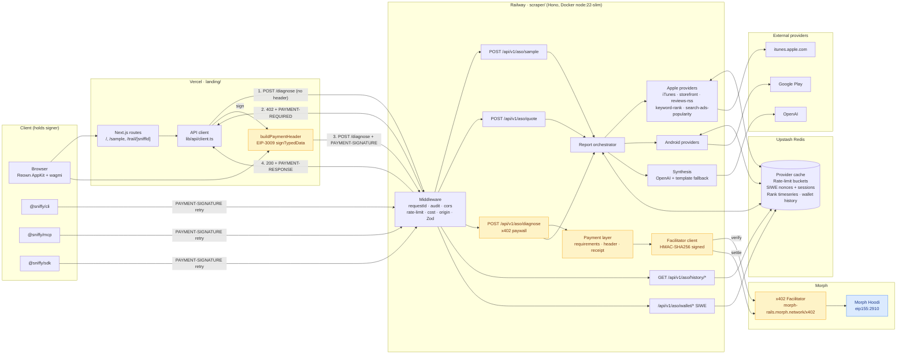
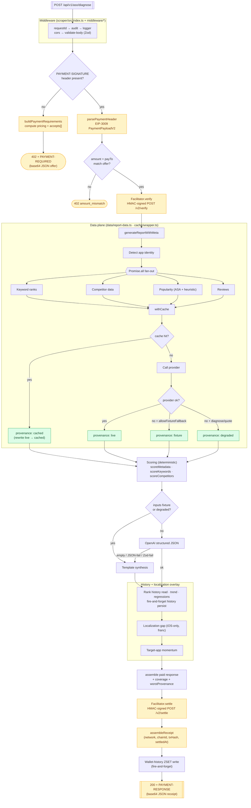

# Sniffy

> Pay-per-sniff ASO intelligence for founders and agents.

Sniffy turns App Store optimization into an **agent-buyable HTTP resource**.
A founder or AI agent submits an iOS app, a country, and a few keywords;
Sniffy quotes the cost, gates the diagnosis behind **x402 on Morph Hoodi**,
and returns a structured visibility report with competitor gaps, metadata
fixes, and ready-to-paste listing copy.

This repo is a hackathon submission for the **x402 Agentic Payments** track,
but it's designed to outlive the hackathon as a real indie-hacker tool.

🐾 **Tagline:** _Sniff out what is costing your app rankings._

---

## What's in the repo

```
asosniffy-com/
├── landing/          Next.js demo UI (Vercel)
├── scraper/          Hono API + x402 payment adapter (Railway)
├── packages/
│   ├── sdk/          @sniffy/sdk — typed TypeScript client
│   ├── cli/          @sniffy/cli — `npx sniffy ...`
│   └── mcp/          @sniffy/mcp — MCP server for Claude Desktop / Cursor
├── SKILL.md          Agent Skills format — canonical API reference for Claude Code / Cursor / Codex
├── skills/           Specialist Agent Skills catalog: sniffy-router, sniffy-context,
│                     sniffy-audit, sniffy-keywords, sniffy-metadata, sniffy-compete,
│                     sniffy-localize, sniffy-momentum
├── PLAN.md           Product requirements doc (authoritative)
└── CLAUDE.md         Working notes for AI contributors
```

The two deployable apps (`landing/`, `scraper/`) keep separate hosts;
`packages/*` are npm-publishable libraries.

---

## Install paths

**As an AI agent skill** (Claude Code, Cursor, Codex, OpenCode, ...):

```bash
npx skills add TheoInTech/asosniffy-com
```

**As an MCP server** (Claude Desktop, Cursor):

```json
{
  "mcpServers": {
    "sniffy": {
      "command": "npx",
      "args": ["-y", "@sniffy/mcp"],
      "env": { "SNIFFY_PRIVATE_KEY": "0x..." }
    }
  }
}
```

**As a CLI**:

```bash
npx @sniffy/cli quote https://apps.apple.com/us/app/example/id123456789 \
  -k "habit tracker,daily planner"
```

**As a TypeScript SDK**:

```bash
npm i @sniffy/sdk
```

```ts
import { createSniffy } from "@sniffy/sdk";

const sniffy = createSniffy({ signer });
const quote = await sniffy.quote({ store: "ios", app, country, keywords });
const report = await sniffy.diagnose({ sniffId: quote.sniffId });
```

See `SKILL.md` (canonical API reference) and `skills/` (specialist catalog: router + 6 specialists + foundation context skill) for the agent-distribution surface, or `PLAN.md` §22 for the full design.

---

## The paid API

The canonical surface is three HTTP endpoints documented in `PLAN.md` §9:

| Endpoint | Auth | Returns |
|---|---|---|
| `POST /api/v1/aso/quote` | None | Price, coverage estimate, **shallow scan** teaser |
| `POST /api/v1/aso/diagnose` | x402 (Morph Hoodi) | Full report + receipt + provenance |
| `GET /api/v1/aso/sample` | None | Fixture report for inspection |

Unpaid calls to `/diagnose` return a real `402 Payment Required` with
machine-readable x402 payment requirements. Agents read the 402, sign on
Morph Hoodi (`eip155:2910`), and retry — exactly the agentic-payments flow
the track is built around.

---

## Architecture

Two canonical Mermaid diagrams of the running system. They are the visual companions to `PLAN.md` §6 (system architecture) and `PLAN.md` §9 (API contract), and they assume the load-bearing constraints in `CLAUDE.md`. Both diagrams represent the **intended live path**; operational state (degraded facilitator, fixture-receipt mode) is tracked in runbook notes, not here.

**Legend** — amber nodes: x402 payment surface · green nodes: provenance assignment (`live` / `cached` / `fixture` / `degraded`, enforced by `scraper/src/cache/wrapper.ts` and `scraper/src/data/coverage.ts`) · blue node: settlement target on Morph.

### Diagram 1 — System architecture



**Evidence anchors**

- Middleware mount: `scraper/src/index.ts:21-78`
- Payment requirements: `scraper/src/payment/requirements.ts:68-141`
- Facilitator HMAC client: `scraper/src/payment/facilitator/client.ts:70-163`
- Header read on retry: `scraper/src/routes/diagnose.ts:54`
- 200 + `PAYMENT-RESPONSE` set: `scraper/src/routes/diagnose.ts:294`
- Browser EIP-3009 signing: `landing/src/lib/wallet/x402.ts:95-163`

### Diagram 2 — Scraper `/diagnose` internals



**Evidence anchors**

- Diagnose route lifecycle: `scraper/src/routes/diagnose.ts:34-310`
- Cache wrapper + `live → cached` rewrite: `scraper/src/cache/wrapper.ts:39-110`
- Provider fan-out: `scraper/src/data/report-data.ts:116-170`
- Synthesis gate + template fallback: `scraper/src/synthesis/openai.ts:67-195`, `scraper/src/synthesis/template.ts`
- `worstProvenance`: `scraper/src/data/coverage.ts:65-72`
- Wallet-history write: `scraper/src/wallet/history.ts`, `scraper/src/routes/diagnose.ts:255-290`

---

## Open-source posture

Sniffy is **MIT-licensed**. The commercial strategy is _open client,
commercial host_: the code is the adoption funnel; the running `sniffy.io`
service, the wallet receiving payments, and the accumulated cache/keyword
history are the business. See `PLAN.md` §23 for details.

The "Sniffy" name and pixel-detective mascot are reserved as trademarks —
you can fork the code under MIT, but please don't ship "Sniffy"-branded
forks.

---

## Contributing

See `CONTRIBUTING.md`. Read `PLAN.md` before opening a non-trivial PR.

The owner pushes directly to `main`; all other contributors open PRs.

---

## Hackathon

- Track: x402 Agentic Payments on Morph.
- Network: Morph Hoodi testnet (`eip155:2910`).
- Facilitator: `https://morph-rails.morph.network/x402` (official).
- Build diary: tagged `#MorphBuildSprint` and `#MorphBuildPH`.

---

## License

[MIT](LICENSE) — see also `NOTICE`.

## Security

Found a security issue? See [`SECURITY.md`](SECURITY.md) — please email,
don't open a public issue.
